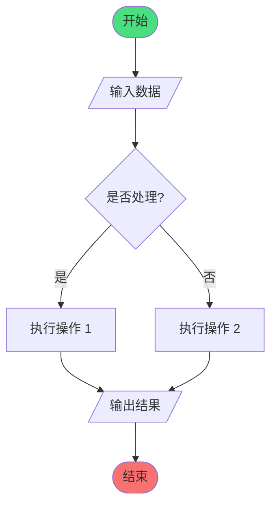

# GraphViewer

<p align="center">
  <strong>🎨 现代化一站式图表可视化工具</strong>
</p>

<p align="center">
  <em>支持 16+ 图表引擎，混合本地/远程渲染</em>
</p>

<p align="center">
  
  <a href="https://github.com/LessUp/graph-viewer/blob/master/LICENSE">
    
  </a>
  <a href="https://github.com/LessUp/graph-viewer/actions/workflows/ci.yml">
    
  </a>
  <a href="https://github.com/LessUp/graph-viewer/actions/workflows/pages.yml">
    
  </a>
  
  
</p>

<p align="center">
  <a href="https://lessup.github.io/graph-viewer/"><strong>🚀 在线演示</strong></a>
</p>

---

## 目录

- [为什么选择 GraphViewer？](#为什么选择-graphviewer)
- [核心特性](#核心特性)
- [快速开始](#快速开始)
- [支持的引擎](#支持的引擎)
- [部署](#部署)
- [开发](#开发)
- [架构](#架构)
- [安全性](#安全性)
- [项目状态](#项目状态)
- [许可证](#许可证)

---

## 🎯 为什么选择 GraphViewer？

| 特性         | GraphViewer             | 传统工具         |
| ------------ | ----------------------- | ---------------- |
| **渲染速度** | ⚡ 本地 WASM (0ms 延迟) | ☁️ 始终远程渲染  |
| **隐私安全** | 🔒 代码不会离开浏览器   | ⚠️ 发送至服务器  |
| **引擎支持** | 16+ 引擎，统一界面      | 通常仅 3-5 个    |
| **分享大小** | ~100 字节 (LZ 压缩 URL) | 大文件或外部链接 |
| **离线支持** | ✅ 本地引擎完全离线     | ❌ 需要网络连接  |

## ✨ 核心特性

- **🚀 16+ 图表引擎**: Mermaid, PlantUML, Graphviz, D2, Vega, Vega-Lite 等
- **⚡ 混合渲染**: 本地 WASM (快速、隐私友好) + 远程 Kroki (广泛支持)
- **📤 多格式导出**: SVG、PNG (2x/4x)、PDF、HTML、Markdown、源代码
- **🔗 即时分享**: LZ-string 压缩 URL，轻松分享图表
- **💾 多图表工作区**: 本地持久化存储，支持版本历史
- **🤖 AI 助手**: 可选的 AI 驱动代码分析和生成
- **👁️ 实时预览**: 带防抖的实时预览，支持手动渲染

## 🚀 快速开始

### 系统要求

- Node.js >= 20.0.0
- npm >= 10.0.0

### 安装

```bash
git clone https://github.com/LessUp/graph-viewer.git
cd graph-viewer
npm install
npm run dev
```

访问 [http://localhost:3000](http://localhost:3000)。

### 环境配置（可选）

复制 `.env.example` 为 `.env` 进行自定义配置：

| 变量                          | 说明                                  | 默认值             |
| ----------------------------- | ------------------------------------- | ------------------ |
| `KROKI_BASE_URL`              | Kroki 渲染服务地址                    | `https://kroki.io` |
| `KROKI_ALLOW_CLIENT_BASE_URL` | 允许客户端指定 Kroki 地址（安全风险） | `false`            |
| `PORT`                        | 服务端口                              | `3000`             |

### 🎯 30 秒快速体验

将以下 Mermaid 代码粘贴到编辑器中，立即体验 GraphViewer：



## 🔧 支持的引擎

### 本地渲染（快速且私密，无需网络）

| 引擎                                      | 说明                     |
| ----------------------------------------- | ------------------------ |
| [Mermaid](https://mermaid.js.org/)        | 流程图、时序图、甘特图等 |
| [Graphviz](https://graphviz.org/)         | 多种布局引擎的图可视化   |
| [Flowchart.js](https://flowchart.js.org/) | 简单易用的流程图语法     |

### 远程渲染（通过 Kroki 代理）

| 引擎                                                                                  | 说明                           |
| ------------------------------------------------------------------------------------- | ------------------------------ |
| [PlantUML](https://plantuml.com/)                                                     | UML 图、思维导图、工作分解结构 |
| [D2](https://d2lang.com/)                                                             | 现代声明式图表                 |
| [Nomnoml](https://nomnoml.com/)                                                       | 简洁的 UML 绘图                |
| [Ditaa](https://ditaa.sourceforge.net/)                                               | ASCII 艺术转图表               |
| BlockDiag / NwDiag / ActDiag / SeqDiag                                                | 块状图、网络图、活动图、时序图 |
| [ERD](https://github.com/BurntSushi/erd)                                              | 实体关系图                     |
| [SVGBob](https://github.com/ivanceras/svgbob)                                         | ASCII 转 SVG                   |
| [WaveDrom](https://wavedrom.com/)                                                     | 数字时序波形图                 |
| [Vega](https://vega.github.io/vega/) / [Vega-Lite](https://vega.github.io/vega-lite/) | 声明式数据可视化               |

> 静态导出模式（GitHub Pages）仅启用本地 3 引擎；完整服务模式（Docker/Node）通过 `/api/render` 代理 Kroki 支持全部 16 引擎。

## 🚢 部署

### Docker (推荐，完整服务模式)

```bash
# 生产环境 + 公共 Kroki
docker compose --profile prod up -d

# 生产环境 + 自建 Kroki（更好的隐私保护）
docker compose --profile prod --profile kroki up -d
```

| Profile | 用途                |
| ------- | ------------------- |
| `prod`  | 生产 Web 服务器     |
| `kroki` | 自建 Kroki 渲染服务 |
| `dev`   | 开发环境（热重载）  |

便捷脚本：`ENV=prod ./scripts/deploy.sh`。

### GitHub Pages (静态导出模式)

```bash
npm run build:static
```

构建产物输出到 `out/`，仅含本地 3 引擎，无需服务端。推送到 `master` 分支会通过 `.github/workflows/pages.yml` 自动部署。

## 🛠️ 开发

```bash
npm run dev          # 开发服务器 (端口 3000)
npm run build        # 生产构建 (含 API 路由)
npm run build:static # 静态导出 (用于 GitHub Pages)
npm run start        # 生产服务器

# 代码质量
npm run test         # 单元测试 (vitest)
npm run lint         # ESLint 检查
npm run typecheck    # TypeScript 检查
npm run format       # Prettier 格式化
```

## 🏗️ 架构

```
用户输入 -> 编辑器 -> 预览引擎
                    ↓
         ┌──────────┴──────────┐
         ↓                     ↓
   本地 WASM             远程 Kroki
   (Mermaid /              (其他所有
    Flowchart /             引擎)
    Graphviz)
         ↓                     ↓
         └──────────┬──────────┘
                    ↓
               SVG/PNG/PDF 输出
```

### 目录结构

```
app/          路由层 (Next.js App Router)
  editor/         编辑器页面
  api/render/     Kroki 代理 API
  api/healthz/    健康检查
components/   UI 层 (按功能域分组)
  editor/ preview/ sidebar/ ai/ version/ dialogs/ landing/ layout/
hooks/        React 逻辑层 (状态、渲染、版本历史、AI、设置)
lib/          纯逻辑层 + 状态层
  diagramConfig.ts    引擎/格式/分组的单一事实源
  runtime.ts          静态导出模式判断的单一事实源
  diagramContext.tsx  图表状态 Context
  render.ts           本地 WASM / 远程 Kroki 渲染分流
  ai/ export/ server/ AI、导出、服务端缓存与限流
scripts/      静态导出 / smoke 测试 / Docker 部署
```

### 关键文件地图

| 责任               | 文件                                                   |
| ------------------ | ------------------------------------------------------ |
| 引擎/格式/展示分组 | `lib/diagramConfig.ts`                                 |
| 运行时环境判断     | `lib/runtime.ts`                                       |
| 应用配置常量       | `lib/config.ts`                                        |
| 图表状态 Context   | `lib/diagramContext.tsx`                               |
| 工作区状态         | `hooks/useDiagramState.ts`                             |
| 本地/远程渲染分流  | `hooks/useDiagramRender.ts`、`lib/render.ts`           |
| 实时预览           | `hooks/useLivePreview.ts`                              |
| Kroki API route    | `app/api/render/route.ts`                              |
| API 缓存/限流      | `lib/server/renderCache.ts`、`lib/server/rateLimit.ts` |
| 错误系统           | `lib/errors.ts`                                        |
| AI 客户端          | `lib/ai/`                                              |
| 导出               | `lib/export/`                                          |
| 静态导出           | `scripts/build-static-export.mjs`、`next.config.js`    |

### 验证命令

```bash
npm run lint          # ESLint
npm run typecheck     # tsc --noEmit
npm run test          # Vitest
npm run build         # standalone 构建 (完整服务版)
npm run build:static  # 静态导出 (GitHub Pages 版)
```

## 🔒 安全性

- 使用 DOMPurify 净化 SVG，Mermaid 严格安全级别
- Kroki URL 规范化并受 allowlist 约束
- 输入长度限制、请求超时、速率限制、inflight 去重
- API Key 不写入 localStorage；AI 面板浏览器直连供应商
- 安全响应头（X-Frame-Options、X-Content-Type-Options 等）

## 📌 项目状态

本项目为业余项目，现已进入**归档状态**，不再主动维护。代码与文档已精简至可自解释的程度，可供参考与二次开发。

## 📄 许可证

[MIT License](LICENSE)

## 🙏 致谢

基于 [Mermaid](https://mermaid.js.org/)、[Kroki](https://kroki.io/)、[CodeMirror](https://codemirror.net/)、[Next.js](https://nextjs.org/) 和 [Graphviz WASM](https://github.com/hpcc-systems/hpcc-js-wasm) 构建。

---

<p align="center">
  用 ❤️ 打造 by GraphViewer 团队
</p>
